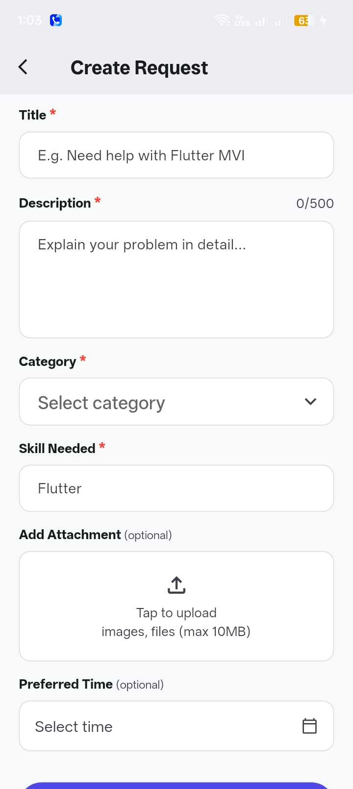
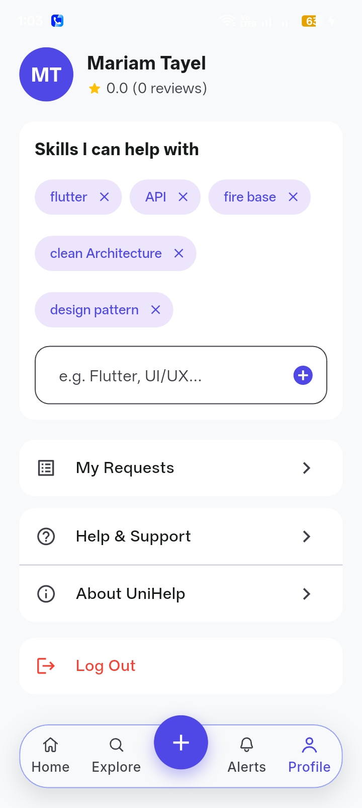

# Uni Help

## Project Overview

Uni Help is a Flutter mobile application that connects university students who need academic or university-related assistance with students who can help them.

The application supports help-request discovery, request creation, student communication, profiles, ratings, and real-time updates.

## Features

* Email and password authentication
* University ID-based login
* Email verification and password recovery
* Google Sign-In
* First-launch onboarding
* Home screen with recent requests
* Request discovery with category filtering
* Help request creation with optional file attachments
* Request details and offer-to-help flow
* Personal request management
* Real-time chat and messaging
* Online/offline user presence
* In-app and local notifications
* User profiles and skills
* Ratings and reviews
* Bottom navigation for the main application sections

## Architecture

Uni Help uses a feature-oriented architecture with elements of Clean Architecture. The structure may vary between features depending on their implementation needs.

### Presentation

The Presentation layer contains the user interface and UI state management:

* Screens
* Widgets
* Cubits
* UI state classes
* Loading, success, and error states

Examples include:

* `features/authentication/presentation/`
* `features/chat_screen/presentation/`
* `features/home_screen/presentation/`
* `features/profile_screen/presentation/`

The project uses `flutter_bloc` Cubits, such as `LoginCubit`, `ChatCubit`, `HomeCubit`, and `ProfileCubit`.

### Domain

The Domain layer contains business rules and abstractions where implemented:

* Entities
* Use cases
* Repository contracts
* Data source contracts

Examples include:

* Authentication entities and use cases
* Chat entities and use cases
* Request creation use cases
* Notification use cases
* Profile and rating use cases

These are mainly located under feature-specific `domain/` directories.

### Data

The Data layer handles external data sources and data conversion:

* Data models and DTOs
* Repository implementations
* Remote data sources
* Firebase Authentication operations
* Firestore reads and writes
* Cloudinary file uploads

Examples include:

* `features/authentication/data/`
* `features/chat_screen/data/`
* `features/create_request/data/`
* `features/notification_screen/data/`
* `core/model/`
* `core/repositories/`

### Core

The Core layer contains reusable and application-wide functionality:

* Shared widgets and animations
* Dependency injection
* Routing
* Theme and colors
* Firebase and Cloudinary services
* Local notifications
* Online/offline presence
* Local and secure storage
* Validators
* Shared entities and utilities

Examples include:

* `core/di/` for GetIt and Injectable registration
* `core/routing/` for application routes
* `core/services/` for Cloudinary, notifications, and presence
* `core/theme/` for colors and text styles
* `core/common/` for reusable widgets
* `core/storage_helper/` for local and secure storage

## Tech Stack

### Framework and State Management

* Flutter
* Dart
* `flutter_bloc` for Cubit-based state management
* GetIt and Injectable for dependency injection

### Firebase Services

* Firebase Authentication
* Cloud Firestore
* Firebase Realtime Database
* Google Sign-In

Firebase is used for authentication, user profiles, help requests, chats, messages, notifications, and online/offline presence.

### File Uploads and Storage

* Cloudinary for request attachments
* `http` for multipart file uploads
* Shared Preferences for local preferences
* Flutter Secure Storage for secure local storage

### UI and Application Support

* `flutter_screenutil` for responsive sizing
* `flutter_svg` for SVG assets
* `cached_network_image` for cached images
* `shimmer` for loading placeholders
* `flutter_local_notifications` for local notifications

## Project Structure

```text
lib/

├── core/
│   ├── common/
│   ├── constant/
│   ├── di/
│   ├── entities/
│   ├── model/
│   ├── repositories/
│   ├── routing/
│   ├── services/
│   ├── storage_helper/
│   ├── theme/
│   ├── utils/
│   └── validators/
│
├── features/
│   ├── app_section/
│   ├── authentication/
│   ├── chat_screen/
│   ├── create_request/
│   ├── explore_screen/
│   ├── home_screen/
│   ├── my_requests/
│   ├── notification_screen/
│   ├── on_boarding/
│   ├── profile_screen/
│   ├── rating/
│   └── request_detail_screen/
│
├── firebase_options.dart
└── main.dart

assets/

├── icons/
├── images/
└── Screenshots/

firestore.rules

pubspec.yaml
```

## Screenshots

<table>
  <tr>
    <td align="center">
      
      <br/>
      <b>Splash</b>
    </td>
    <td align="center">
      
      <br/>
      <b>Onboarding</b>
    </td>
    <td align="center">
      
      <br/>
      <b>Login</b>
    </td>
    <td align="center">
      
      <br/>
      <b>Sign Up</b>
    </td>
    <td align="center">
      
      <br/>
      <b>Home</b>
    </td>
  </tr>
  <tr>
    <td align="center">
      
      <br/>
      <b>Explore</b>
    </td>
    <td align="center">
      
      <br/>
      <b>Create Request</b>
    </td>
    <td align="center">
      
      <br/>
      <b>My Requests</b>
    </td>
    <td align="center">
      
      <br/>
      <b>Profile</b>
    </td>
    <td align="center">
      
      <br/>
      <b>About Uni Help</b>
    </td>
  </tr>
</table>
